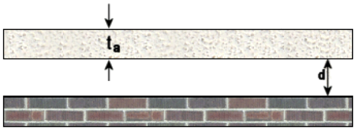

# Porous Absorber Calculator

Calculates the absorption curve of a porous absorber layer both with and without an air gap between it and some impermeable boundry as shown in this diagram:

The absorber thickness (***ta***) can range from 5mm up to 500mm and the air gap (***d***) can range from zero to 500mm

This app was written as part of an on-going exercise in learning Rust and cross-compiling it to Web Assembly using [wasm-pack](https://rustwasm.github.io/wasm-pack/installer/)

## Online Version

An online version of this tool is available [here](http://whealy.com/acoustics/PA_Calculator/index.html)

## Architecture

The WASM function receives the 8 arguments listed in the table below and from these, calculates the absorption curve of that particular absorbent system.  The absorption curve is then generated as an HTML `canvas` directly by Rust interacting with the browser DOM through [wasm-bindgen](https://rustwasm.github.io/wasm-bindgen/introduction.html)

## Local Installation

These instructions assume you have already installed Rust and `wasm-pack`, and that Python3 is available to act as a Web server.

1. Clone this repo
2. Change into the repo's top-level directory
3. Compile using `wasm-pack build --release --target web`
4. Start a Python3 Web server using `python3 -m http.server`
5. Visit <http://0.0.0.0:8000>

## Usage

When the app starts, the absorption curve is always plotted using default values.

| Property | Min | Default value | Max |
|---|---|---|---|
| Absorber thickness | 5 mm | 30 mm | 500 mm
| Absorber flow resistivity | 100 rayls/m | 16,500 rayls/m | 100,000 rayls/m 
| Cavity air gap | 0 mm | 100 mm | 500 mm
| Angle of indcidence | 0° | 0° | 89°
| Graph start frequency | 20 Hz | 62.5 Hz | 200 Hz
| Octave subdivisions | 1 | 1 | 1, 2, 3 or 6
| Air temperature | -20°C | 20°C | 100°C
| Air pressure | 0.800 Bar | 1.000 Bar | 1.100 Bar 

### Graph Start Frequency

The graph always plots an 8 octave range starting at the specified start frequency.  Normally, this should be left set to 62.5 Hz in order to see the standard analysis range (i.e. up to 16 KHz).  However, should you wish to, you can set the start frequency to be as low as 20 Hz, in which case, you will still see an 8 octave range, but the upper limit will now be 5.1 KHz

### Input using sliders

All inputs are made using the range sliders.  The sliders can be moved either by dragging the button with the mouse, or for more precise input, select the slider and use the left/right arrow keys.

I decided to use sliders as the input UI element instead of simple input fields for two reasons:

1. It prevents erroneous or out of range values from being entered, thus ensuring that the calculation engine always receives valid input
2. It creates an "animation" effect whereby you can see how the absorption curve changes dynamically as you move a slider

## ToDo

* Implement curve smoothing

## Known Issues

None so far

## Support

Support *can* be provided but I cannot guarantee a prompt response...

## Contributing

Chris Whealy  <chris@whealy.com>

## License

This project is licensed under the Apache Software License, Version 2.0 except as noted otherwise in the [LICENSE](LICENSE) file.

