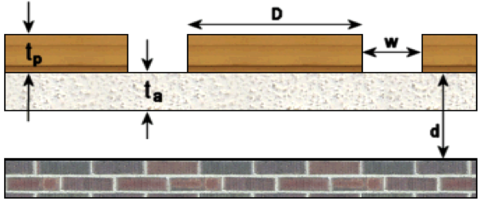
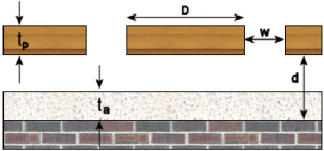

# Porous Absorber Calculator

Calculates the acoustic absorption curve of a variety of porous absorber devices mounted against a rigid backing such as a brick wall.

The porous absorber is typically made from some material such as Rockwool or glass fibre insulation.  You need to know the flow resistivity of this material in order to get the best results from these calculations.

## Absorber Device Types

At the moment, three absorber devices have been implemented

### Simple Porous Absorber

A simple porous absorber layer of thickness ***ta*** is mounted over a rigid backing.

Two absorption curves are calculated:

* The porous absorber layer is mounted directly to the rigid backing, or
* The porous absorber is mounted above an air gap of depth ***d***
    

### Perforated Panel

A perforated panel of thickness ***tp*** with circular holes of radius ***a*** at a spacing ***D*** is mounted above a cavity whose total depth is ***d*** and containing a porous absorber layer of thickness ***ta***.

Three absorption curves are calculated:  

* The perforated panel is mounted directly to the porous absorber layer, which in turn is mounted directly to the rigid backing.  I.E. The air gap is zero.
* Perforated Panel -> Porous Absorber -> Air Gap -> Backing 
     
* Perforated Panel -> Air Gap -> Porous Absorber -> Backing
     

### Slotted Panel

A slotted panel of thickness ***tp*** with slots of width ***w*** at a spacing ***D*** is mounted above a cavity whose total depth is ***d*** and containing a porous absorber layer of thickness ***ta***.

Three absorption curves are calculated:  

* The slotted panel is mounted directly to the porous absorber layer, which in turn is mounted directly to the rigid backing.  I.E. The air gap is zero.
* Slotted Panel -> Porous Absorber -> Air Gap -> Backing 
     
* Slotted Panel -> Air Gap -> Porous Absorber -> Backing
     

## Background

This app is the reimplementation of an [Excel spreadsheet](http://whealy.com/acoustics/Porous.html) I wrote in 2004 and is part of an on-going exercise in learning Rust and cross-compiling it to Web Assembly using [wasm-pack](https://rustwasm.github.io/wasm-pack/installer/)

## Calculations

All the calculations used by this app are derived from the book "*Acoustic Absorbers and Diffusers.  Theory, Design and Practice*" by Trevor Cox and Peter D'Antonio (First Edition)

## Online Version

An online version of this tool is available [here](http://whealy.com/acoustics/PA_Calculator/index.html)

## Architecture

The WASM function receives the 8 arguments listed in the table below and from these, calculates the absorption curve of that particular absorbent device.  The absorption curve is then generated as an HTML `canvas` directly by Rust interacting with the browser DOM through [wasm-bindgen](https://rustwasm.github.io/wasm-bindgen/introduction.html)

## Local Installation

These instructions assume you have already installed Rust and `wasm-pack`, and that Python3 is available to act as a Web server.

1. Clone this repo
2. Change into the repo's top-level directory
3. Compile using `wasm-pack build --release --target web`
4. Start a Python3 Web server using `python3 -m http.server`
5. Visit <http://0.0.0.0:8000>

## Usage

When the app starts, the "Rigid Backed Porous Absorber" tab will be selected by default.

If this is the first time you have run this calculator, then all calculations will be performed using default values.  If you have used this calculator before, then each of the curves will be plotted using your previous values.

## Default Values

### Rigid Backed Porous Absorber

| Property | Min | Default value | Max |
|---|---|---|---|
| Absorber thickness | 5 mm | 30 mm | 500 mm
| Absorber flow resistivity | 100 rayls/m | 16,500 rayls/m | 100,000 rayls/m 
| Cavity air gap | 0 mm | 100 mm | 500 mm
| Angle of indcidence | 0° | 0° | 89°
| Graph start frequency | 20 Hz | 62.5 Hz | 100 Hz
| Octave subdivisions | 1 | 1 | 1, 2, 3 or 6

### Slotted Panel

| Property | Min | Default value | Max |
|---|---|---|---|
| Panel thickness | 1.0 mm | 10 mm | 50.0 mm
| Slot distance | 2.0 mm | 25.4 mm | 300 mm
| Slot width | 1.0 mm | 5.0 mm | 50.0 mm
| Absorber flow resistivity | 100 rayls/m | 16,500 rayls/m | 100,000 rayls/m 
| Absorber thickness | 5 mm | 30 mm | 500 mm
| Air gap | 0 mm | 100 mm | 500 mm
| Graph start frequency | 20 Hz | 62.5 Hz | 100 Hz
| Octave subdivisions | 1 | 1 | 1, 2, 3 or 6

### Perforated Panel

| Property | Min | Default value | Max |
|---|---|---|---|
| Panel thickness | 1.0 mm | 10 mm | 50.0 mm
| Hole centred every | 2.0 mm | 25.4 mm | 300 mm
| Hole radius | 1.0 mm | 5.0 mm | Half hole centre distance
| Absorber flow resistivity | 100 rayls/m | 16,500 rayls/m | 100,000 rayls/m 
| Absorber thickness | 5 mm | 30 mm | 500 mm
| Air gap | 0 mm | 100 mm | 500 mm
| Graph start frequency | 20 Hz | 62.5 Hz | 100 Hz
| Octave subdivisions | 1 | 1 | 1, 2, 3 or 6

### Microperforated Panel

Not implemented yet

### Configuration

| Property | Min | Default value | Max |
|---|---|---|---|
| Air temperature | -20°C | 20°C | 100°C
| Air pressure | 0.800 Bar | 1.000 Bar | 1.100 Bar 

## Graph

If desired, the "Smooth curve" checkbox can be switched on.  This will connect each plot point using Bézier curves; however, it should be noted that this feature was added for its aesthetic appeal and does ***not*** imply that the actual absorption between the plot points follows the line drawn on the screen

### Graph start frequency

The graph always plots an 8 octave range starting at the specified start frequency.  Normally, this should be left set to 62.5 Hz in order to see the standard analysis range (i.e. up to 16 KHz).  However, should you wish to, you can set the start frequency to be as low as 20 Hz, in which case, you will still see an 8 octave range, but the upper limit will now be 5.1 KHz

### Input using sliders

All inputs are made using the range sliders.  The sliders can be moved either by dragging the button with the mouse, or for more precise input, select the slider and use the left/right arrow keys.

I decided to use sliders as the input UI element instead of simple input fields for two reasons:

1. It prevents invalid or out of range values from being entered, thus ensuring that the calculation engine always receives valid input
2. It creates an "animation" effect whereby you can see how the absorption curve changes dynamically as you move a slider

## To Do

Implement the calculations for a micro-perforated panel above an air gap.  No porous absorber material is needed in this type of device.

Display the value of each plot point when the mouse pointer hovers it

## Known Issues

None so far

## Support

Support *can* be provided but I cannot guarantee a prompt response...

## Contributing

Chris Whealy  <chris@whealy.com>

## License

This project is licensed under the Apache Software License, Version 2.0 except as noted otherwise in the [LICENSE](LICENSE) file.

