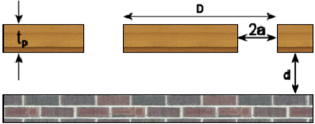

# Microperforated Panel

A microperforated absorber does not require a porous absorber layer because energy losses are achieved using the visous boundary layer within the perforations.  In order for this device type to be effective, the perforations must be sub-millimetre in diameter.

The advantage of this device type is that it can be constructed from clear materials such as perspex or glass.

A microperforated panel of thickness ***tp*** with circular holes of radius ***a*** at a spacing ***D*** is mounted above a cavity whose total depth is ***d***.

## Default Graph

## Value Ranges

| Property | Min | Default value | Max |
|---|---|---|---|
| Panel thickness | 0.5 mm | 1.0 mm | 5.0 mm
| Hole centred every | 0.5 mm | 4.0 mm | 10.0 mm
| Hole radius | 0.05 mm | 0.20 mm | Half hole centre distance, but not exceeding 0.5mm
| Air gap | 1 mm | 50 mm | 200 mm
| Angle | 0° | 0° | 89°
| Graph start frequency | 20 Hz | 62.5 Hz | 100 Hz
| Octave subdivisions | 1 | 1 | 1, 2, 3 or 6

